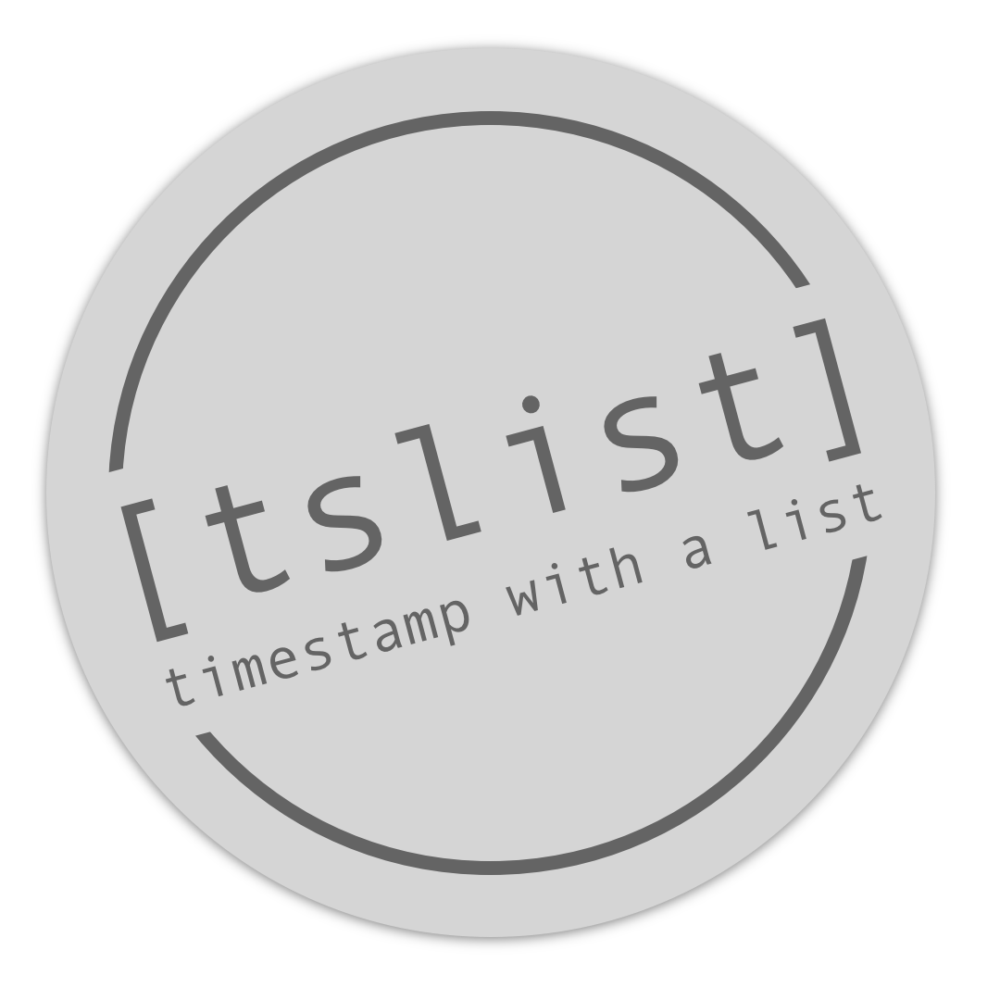

Python Project *tslist*
-----------------------------------------------------------------------

.. image:: https://github.com/sonntagsgesicht/tslist/actions/workflows/python-package.yml/badge.svg
    :target: https://github.com/sonntagsgesicht/tslist/actions/workflows/python-package.yml
    :alt: GitHubWorkflow

.. image:: https://img.shields.io/readthedocs/tslist
   :target: http://tslist.readthedocs.io
   :alt: Read the Docs

.. image:: https://img.shields.io/github/license/sonntagsgesicht/tslist
   :target: https://github.com/sonntagsgesicht/tslist/raw/master/LICENSE
   :alt: GitHub

.. image:: https://img.shields.io/github/release/sonntagsgesicht/tslist?label=github
   :target: https://github.com/sonntagsgesicht/tslist/releases
   :alt: GitHub release

.. image:: https://img.shields.io/pypi/v/tslist
   :target: https://pypi.org/project/tslist/
   :alt: PyPI Version

.. image:: https://img.shields.io/pypi/pyversions/tslist
   :target: https://pypi.org/project/tslist/
   :alt: PyPI - Python Version

.. image:: https://pepy.tech/badge/tslist
   :target: https://pypi.org/project/tslist/
   :alt: PyPI Downloads

Introduction
------------

To import the project simply type

.. code-block:: python

    >>> import tslist

after installation.

The TS filtered list enhances the standard
`list <https://docs.python.org/3/library/stdtypes.html#list>`_
by filtering the list by
`slices <https://docs.python.org/3/library/stdtypes.html#list>`_
of types **T** differing from **int**
in which (before comparision) any item **x**
is converted to type **T** by calling **T(x)**

    >>> from tslist import TSList

    >>> l = 1.0, 1.1, 1.2, 1.3, 1.4, 1.5, 1.6, 1.7, 1.8, 1.9
    >>> tsl = TSList(l)
    >>> tsl
    TSList([1.0, 1.1, 1.2, 1.3, 1.4, 1.5, 1.6, 1.7, 1.8, 1.9])

    >>> tsl[1.0:1.3]  # filter all items between 1.0 (included) and 1.3 (excluded)
    TSList([1.0, 1.1, 1.2])

    >>> tsl[1.0:1.31]
    TSList([1.0, 1.1, 1.2, 1.3])

    >>> tsl[1.1]  # filter all items at 1.1
    TSList([1.1])

    >>> tsl.append(1.1)
    >>> tsl[1.1]
    TSList([1.1, 1.1])

This becomes even more handy if list items admit conversions.

    >>> from datetime import timedelta, datetime
    >>> from tslist import TS

    >>> class Timedelta(timedelta):
    ...     def __float__(self):
    ...         return self.total_seconds()
    ...
    ...     def __ts__(self):
    ...         # used for conversion using tslist.TS
    ...         return datetime(2000, 1, 1) + self

    >>> l = [Timedelta(d) for d in range(10, 15)]
    >>> tsl = TSList(l)
    >>> tsl
    TSList(
    [ Timedelta(days=10),
      Timedelta(days=11),
      Timedelta(days=12),
      Timedelta(days=13),
      Timedelta(days=14)]
    )

    >>> list(map(float, tsl))
    [864000.0, 950400.0, 1036800.0, 1123200.0, 1209600.0]

    >>> tsl[950400.:1209600.:2]
    TSList([Timedelta(days=11), Timedelta(days=13)])

    >>> list(map(TS, tsl))
    [TS(20000111), TS(20000112), TS(20000113), TS(20000114), TS(20000115)]

    >>> tsl[TS(20000112):TS(20000114)]
    TSList([Timedelta(days=11), Timedelta(days=12)])

See TS() for more detail on timestamp and datetime conversion.

Documentation
-------------

More docs can be found on `https://tslist.readthedocs.io <https://tslist.readthedocs.io>`_

Install
-------

The latest stable version can always be installed or updated via pip:

.. code-block:: bash

    $ pip install tslist

License
-------

Code and documentation are available according to the license
(see LICENSE file in repository).
